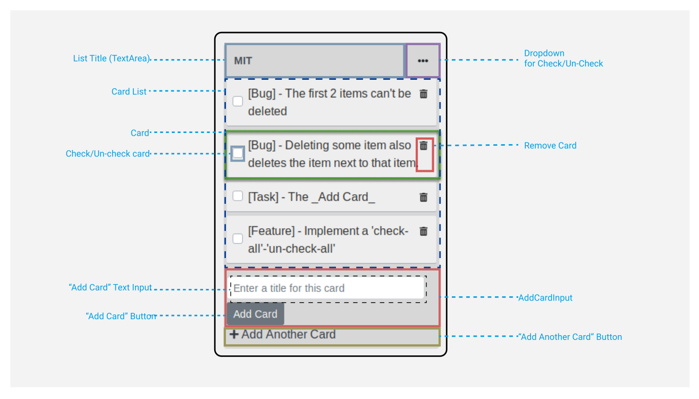
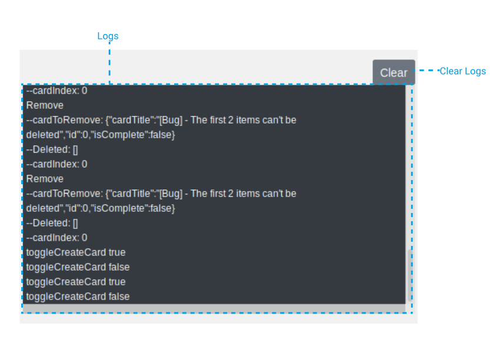

# Vue Exercise 4

### Setup the environment

- Install the dependencies

  ```
  yarn install
  ```

- Run development server

  ```
  yarn serve
  ```

## Overview

This is a Todo list.

**List** - Simply think of this list as a notepad.

**Card** - This is the todo's. A card can contain description.





The List schema:

| Property          | Type                |
| ----------------- | ------------------- |
| `list`            | Object&lt;Listt&gt; |
| `listTitle`       | String              |
| `cardList`        | Array&lt;Card&gt;   |
| `cardTitle`       | String              |
| `cardDescription` | String              |
| `isComplete`      | Boolean             |

**JSON Structure**

```json
{
  "list": {
    "listTitle": "M.I.T.",
    "cardList": [
      {
        "cardTitle": "Gather 2 milk from the ranch",
        "cardDescription": "AAA",
        "isComplete": false
      },
      {
        "cardTitle": "Cook pasta",
        "cardDescription": "AABB",
        "isComplete": false
      },
      {
        "cardTitle": "Clean mah dog.",
        "cardDescription": "AABB",
        "isComplete": false
      }
    ]
  }
}
```

##### `src/utils/storage/list-storage.js`

Cards are saved on and loaded from browser's localstorage

## Your tasks.

#### [Task] - Add an item/card to the list

#### [Task] - Properly remove an item on the list

#### [Task] - The _Add Card_

- When `+ Add Another Card` is clicked, it should not be shown (hidden). Then the _Add Card_ button and the textbox should show.

#### [Feature] - Implement a 'check-all'-'un-check-all'

When the horizontal ellipsis icon-button was clicked. A dropdown shows up.

When 'Complete All' was selected. Check all the items/card in the list.

When 'Un-check All' was selected. Remove the check on the items/card in the list.

#### [Task] - Clear the _logs_

A button to clear the logs
